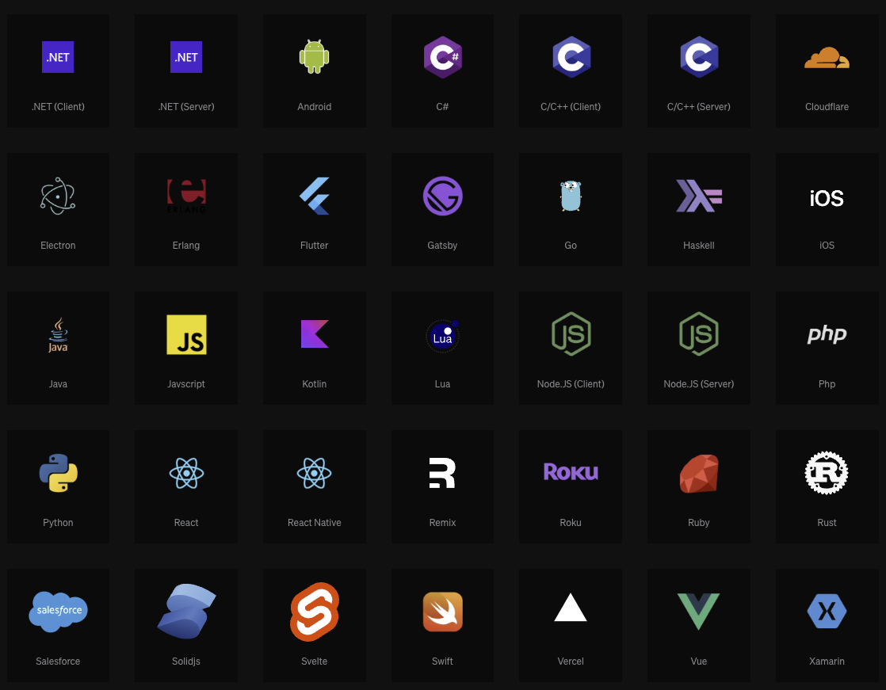
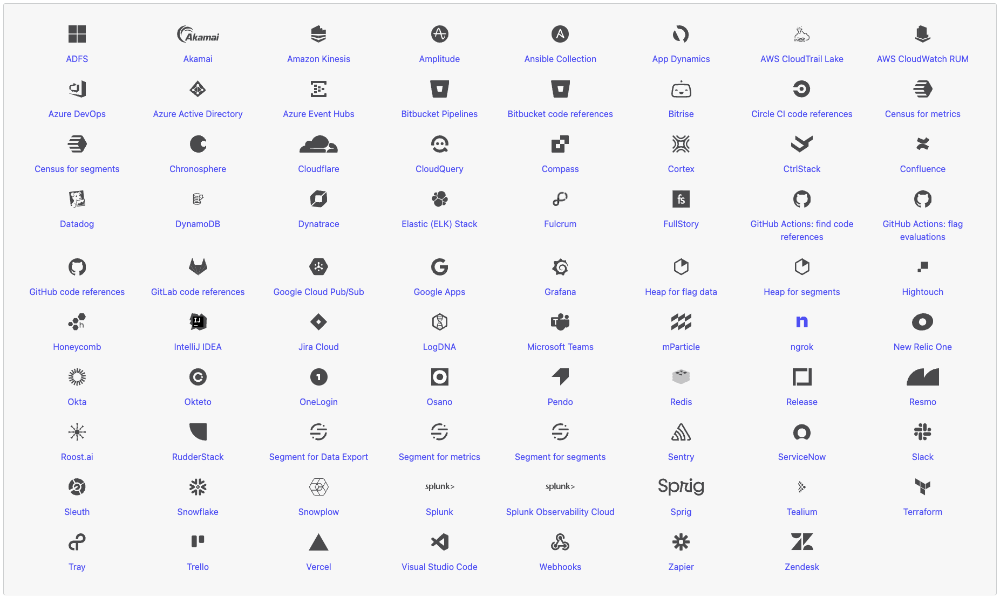
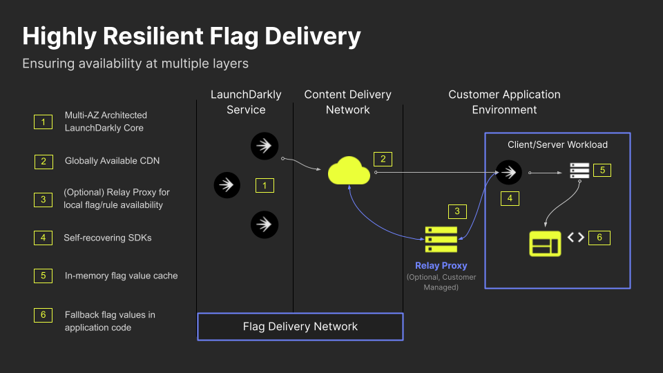

# Top 5 Reasons Why LaunchDarkly Outshines DIY Feature Flags

Feature flags have become such a widely used tool in managing releases that many, if not most, companies have some kind of solution. In many cases, this takes the form of homegrown or "do it yourself" (DIY) feature flags.

Broadly speaking, here are the most common types of DIY solutions:

* **The config** – This is the single most common DIY solution as it is also the easiest to create. Typically, the config takes the form of some kind of structured data file like YAML, however, in some cases, flag configuration values are held in a remote config solution.
* **The database** – This slightly more advanced option generally makes it easier to use flags across teams and applications. It is sometimes managed by directly making changes to the database values or via some form of simple homegrown flag management tool.
* **The platform** – In rare cases, companies (usually large enterprises) have invested in building and maintaining a complete, in-house feature management platform. This usually comes with a team who is responsible for updates and maintenance of the platform.

While all these solutions can work, they all come with limitations or complications that make a feature management platform like LaunchDarkly a better choice in most scenarios. Let's look at five of the most important reasons why.

## Works Anywhere Across Your Application

One of the common issues with homegrown feature flag solutions tends to be that they solve the problem for one specific area of the application. For example, the backend team may have created a solution for their domain but the frontend team doesn't have one (or has a different one). This lack of standardization across the various teams in the company can lead to issues. For example, where a feature is turned on in the API but not in the parts of the application consuming that API change.

A system like LaunchDarkly resolves those issues by being available anywhere you need it in your application. The primary way we do this is via our [more than 25](https://launchdarkly.com/features/sdk/). Whether you are a team working on the backend, frontend, mobile or DevOps, it's incredibly likely that we already have an SDK that works for you.

This means that, not only can you share flags across multiple aspects of your application, but you'll be able to access them all in a consistent manner with consistent functionality.

But it goes beyond just SDKs. Sometimes you need access to flag data or flag values in other services that your company relies upon. For example, perhaps you want to automatically turn off a feature if certain thresholds are met in Datadog or you want to trigger a marketing campaign workflow automatically when a feature goes live via Zapier.

LaunchDarky has [almost 80 integrations](https://docs.launchdarkly.com/integrations) and counting. That's the kind of thing a homegrown system is unlikely to have because each external integration would require significant engineering resources to build.

## Near-instant Response and Updates

One of the most commonly cited use cases for feature flags is the kill switch. The concept behind the kill switch is that if a feature, particularly a newly launched feature, is broken or causes performance degradation, you can turn it off rather than have to rollback and redeploy. But what happens if your kill switch itself requires a redeploy? You've saved yourself from the painful rollback, but the problematic feature isn't disabled until the redeploy completes.

This kind of delay can be costly, but it's also unnecessary. All connected clients receive updates from LaunchDarkly in 100ms or less. That means that as soon as you turn a feature off in the LaunchDarkly dashboard, it can be turned off everywhere it needs to be within your application code. This is a capability most homegrown systems cannot match.

You may be wondering, "But doesn't this degrade performance?" It's true that it would be difficult to beat the performance of a config that is evaluated at deploy time, but if your needs go beyond the basic capabilities of a config, it would be difficult to replicate LaunchDarkly's performance with a DIY system.

That's because LaunchDarkly has multiple layers that make it incredibly fast.

1. **The Flag Delivery Network** – LaunchDarkly's flag data comes from a globally distributed CDN, meaning that it is ultra-fast and benefits from reduced latency.
2. **Cached Responses** – LaunchDarkly's SDKs automatically cache the flag data that they need locally, meaning that flag values are retrieved from the local cache, making them extremely fast and resilient in the case of outages.
3. **Streamed updates** – When an SDK client is initialized, it establishes a streaming connection for flag updates so that any changes you make in LaunchDarkly will be received by connected clients within 100 ms. This means that if you flip that kill switch, the feature is off almost immediately.

Building and maintaining the necessary infrastructure and architecture for extremely fast, resilient and immediately responsive flags can be a massive undertaking. It's not one most internal engineering teams would have the resources for. This means that many homegrown solutions can suffer from slower flag retrieval, a lack of resiliency and an inability to respond quickly to updates.

## Advanced Targeting Capabilities

Targeting is the "secret sauce" of feature flags. Being able to turn a feature on or off for everyone in a particular environment is useful, but being able to turn a feature on or off for individuals or segments is incredibly powerful and opens up all kinds of new capabilities:

* **Phased rollouts and canary releases** – Targeting unlocks the ability to gradually release a feature, which can help limit the blast radius of any issues and help ensure that, when a release is complete, it is solid and stable. For example, you can roll out a release to ever larger targeted segments, phase a rollout to an increasing percentage of users chosen at random or do a canary release to a subset of users.
* **Beta programs** – While a beta program can be part of a phased rollout process or canary release, it typically is used an an ongoing tool to help determine both in testing that a feature works as well as making sure it meets user expectations. Users who are chosen for or opt-into a beta program will typically get early access to features in development helping to refine the feature before it is fully released. Maintaining access for a beta program can be difficult without the ability to target features to individuals.
* **Entitlements** – Managing [entitlements](https://launchdarkly.com/blog/managing-entitlements-in-launchdarkly/) is all about who has access to what features. This can be a complex problem to solve, especially with any software as a service (SaaS) product. Feature flags combined with comprehensive targeting are perfectly designed for handling these sorts of entitlement issues within application code while allowing them to be easily configurable, without requiring rewrites.
* **Experimentation** – Experimentation offers the ability to test software changes to ensure that they achieve the expected results. This requires the ability to place users into cohorts and target them with the correct randomized variation, capture the necessary measurements for the test and perform analysis on the test (this is obviously a very simplified explanation of a complex topic). These sorts of capabilities require significant engineering resources as well as specific data analysis expertise that an internal team is unlikely to be able to easily (or affordably) replicate.

Building even basic targeting capabilities into a homegrown solution is a complex problem to solve. There are so many layers. You need a way to easily pass data about the user from the client to the flag solution. You need a rules engine to determine the correct variation to serve. You need a way to manage those rules easily. Ultimately, this means that you've committed to building and maintaining a complete feature management platform in-house, taking precious engineering resources away from your core business.

## Manage Access, Approvals and Governance

In most homegrown systems, changing flags is a manual process that requires developer intervention and there is no managed access control. This means that any developer with access to the config or database can add or update flags and the audit trail, to the extent that one exists, requires examining noisy logs. For a limited set of flags shared across a small development team, this may meet your minimum requirements for a time, but in most cases you'll very quickly outgrow this.

LaunchDarkly has access controls, detailed audit logs of changes, approval workflows and even detailed feature flag metrics. Here are just a handful of the reasons why this can be critically important:

* **Ensure each team only has access to their flags** – It can be difficult for a homegrown system to service multiple teams while maintaining the necessary level of access control, which can lead to potential issues. LaunchDarkly has fine-grained access controls to ensure that only the appropriate person(s) can make create, view or change a flag, segment, targeting rule, etc.
* **Prevent potential mistakes by adding approvals** – Mistakes can happen, even when using feature flags. A developer may accidentally flip a flag or change a setting in the wrong environment causing issues. LaunchDarkly allows you to set up an approval process so that changes can be verified wherever necessary before they take effect.
* **Keep an audit trail for regulatory or compliance purposes** – It can be important to keep track of what changes were made, when those changes were made and who made them. Most homegrown systems rely on digging through messy logs if they have any records at all, but LaunchDarkly provides detailed audit trails on any changes made.
* **Eliminate "flag debt"** – One of the things to be aware of when adopting feature flags is that, if you aren't careful about cleanup, you can end up with flags littering your code (aka flag debt). LaunchDarkly provides tools and metrics to help you build internal processes that can eliminate flag debt. For instance, there is tagging to help organize and find flags, metrics to highlight flags that are no longer in use and code references to show you where those flags exist within your project's codebase.

These are the sorts of features that can seem like overkill when building a homegrown system, because the amount of work required to build them is significant, but show there value once, for example, they prevent a potential incident or you're asked for audit trails for compliance or your spend multiple cycles cleaning up flag debt.

## Anyone Who Needs to Can Manage

One of the most common issues in homegrown systems is that every change requires developer intervention. Let's take the example of an incident. Support may be the first to become aware of an incident via direct customer reports. They may need to flag an engineering manager who then tasks an engineer with updating the flag in the config and redeploying. Despite the benefits of feature flags, a lot of time has passed since the initial report of the incident and the resolution – time that could have been avoided if support had access to make flag changes where appropriate.

In fact, there are many decisions about when to turn on a feature or alter segments and targeting that are not engineering decisions. Oftentimes they belong to other stakeholders like product managers, product marketing managers or support. A product manager may determine who is in the beta access group. Marketing may want to align the timing of a redesign launch to the start of a campaign. I could go on but the point is that, by requiring a developer to intervene, a homegrown feature flag system puts unnecessary burdens on the engineers while also frustrating the stakeholders.

LaunchDarkly's intuitive user interface combined with its access controls makes it easy to give the appropriate people access to make these changes. Combined with the access control, approval and auditing features in the prior section, it means that you can let the stakeholders who need access have the right kind of access without worry. This relieves the unnecessary burden on your engineering teams while also putting the decision-making in the correct hands.

## Making The Move From HomeGrown

At this point, hopefully you are fully convinced that making the move from a homegrown system to LaunchDarkly is the right way to go. But perhaps you are concerned that migrating from your current homegrown solution would be a massive burden. Thankfully, it isn't.

First, any migration doesn't have to be all or nothing and can be done incrementally. Start by making all new flags in LaunchDarkly and, as flags get deprecated in the old system, remove them. Since many, if not most, flags are temporary, this will go a long way to removing the old system without creating additional burden on the team to replace existing flags that are ephemeral.

Second, replacing any long-lived or permanent flags is made much easier by LaunchDarkly's SDKs. Once the SDK is initialized across the application, replacing an existing flag may require as little as changing one line of code to get the value. This is especially true if your existing system is a config or database without any form of targeting.

Third, and finally, begin adopting the more advanced features in LaunchDarkly like targeting, experimentation and more, in a step-by-step manner rather than try to do everything at once. You can take a look at the [five stages of feature flag adoption](https://launchdarkly.com/blog/the-five-stages-of-feature-flag-adoption/) to help guide you.

A migration off of a homegrown system to LaunchDarkly doesn't have to be painful and, as we've seen, comes with enormous benefits.